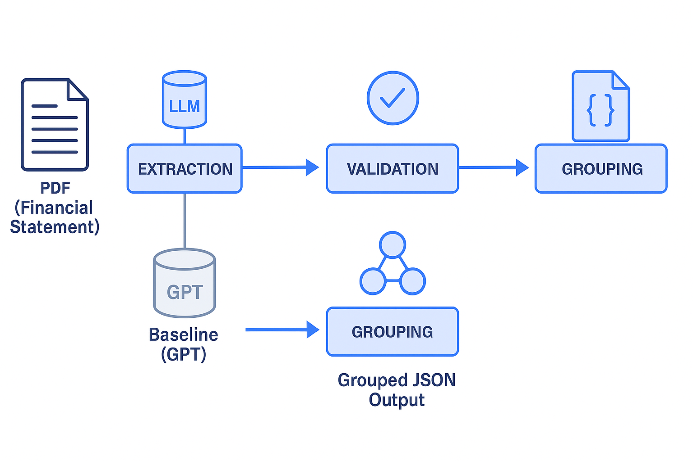

# Financial Statement Extraction Using RAE and Ollama

This repository experiments with a Retriever-Augmented Extraction (RAE) flow for Indonesian financial statements.  
Starting from raw PDFs, the pipeline:

1. Extracts page text, segments it into statement-specific chunks, and asks an Ollama-hosted LLM (convert2json.py).
2. Normalises and groups the model output into Balance Sheet / Income Statement buckets (grouping.py).
3. Validates the grouped data against basic accounting identities and a GPT baseline (validation\_*.py scripts).

The project focuses on making the extraction process reproducible, debuggable, and measurable.

---

## 1. Extraction & Grouping Logic

### `convert2json.py`
- Loads configuration from `src/config.yaml` (endpoint, model, segmenter window, prompt template).
- Grabs extraction prompts from `src/prompts.yaml` via `src/loadyaml.py`.
- Reads the PDF with `PyPDF2`, tags each page, and sends relevant sections to the LLM through `LLMClient`.
- Cleans the LLM response and writes the result to JSON (`report.json` by default).

### `grouping.py`
- Consumes the LLM output (`report.json`).
- Uses `category_hint` and section context to route line items into:
  - `Assets` (Current / Non-current)
  - `Liabilities` (Current / Non-current)
  - `Equity`
  - `Income Statement Items`
  - `Other Indicators` (fallback for unclassified metrics)
- Produces `grouped_report.json`, a normalised structure with consistent keys ready for validation and comparison.

### Validation Scripts
- `validate_financials.py`: checks for missing/negative values, and whether Assets = Liabilities + Equity within ±5%.
- `validate_comparison.py`: compares our grouped output against the GPT baseline (`report_baseline_gpt.json`), reporting overlap, gaps, and regression metrics.

---

## 2. Running The Pipeline

### Prerequisites
1. Python 3.11+ (project uses `PyPDF2`, `aiohttp`, etc.).
2. Install dependencies:
   ```bash
   pip install -r requirements.txt
   ```
3. Ensure Ollama (or compatible LLM service) is running at the URL in `src/config.yaml`.
4. Place the target PDF (e.g. `FinancialStatement-2024-Tahunan-EKAD.pdf`) in the project root.

### Extract LLM Output
```bash
python convert2json.py \
  --pdf FinancialStatement-2024-Tahunan-EKAD.pdf \
  --output report.json
```
- **Config knobs** (in `src/config.yaml`):
  - `llm.url`, `llm.model`, `llm.timeout_seconds`, `llm.retries`, `llm.backoff_factor`
  - `section_segmenter.chunk_size`
  - `prompts.file`, `prompts.key`
- These can be overridden with environment variables (`LLM_URL`, `LLM_MODEL`, etc.).

### Group Items
```bash
python grouping.py
```
Defaults to reading `report.json` and writes `grouped_report.json`.  
Update the script arguments or edit near the `if __name__ == "__main__"` block to point at different files.

### Run Validations
```bash
python validate_financials.py
python validate_comparison.py
```
Produces:
- `validation_financial_report.json`
- `validation_comparison_report.json`

---

## 3. Validation Summaries

### `validation_financial_report.json`
- **Missing values**: 286 entries flagged (many “name / current_year / previous_year / category_hint” placeholders highlight incomplete data from extraction).
- **Negative values**: none detected.
- **Balance check**:
  - Total Assets: 740,899,588,753
  - Total Liabilities: 0
  - Total Equity: 77,228,164,962
  - Difference vs. Assets: 663,671,423,791 (tolerance ±37,044,979,438) → **not balanced**.
- **Summary**: significant coverage gaps remain in both current year values and liability mapping.

### `validation_comparison_report.json`
- Our extractor produced **94 fields** vs GPT baseline’s 48.
- Overlap: only **4 common fields** (missing rate ≈94% because the two outputs use different schemas).
- Metrics (on the shared fields): Accuracy 100%, MAE 0.0, MAPE 0%, RMSE 0, R² 1.0.
- Largest gaps are in cash flow, equity roll-forward, and detailed income statement lines—highlighting where prompt engineering or post-processing should focus.

---

## 4. Overall Summary

The RAE pipeline successfully automates:
1. **LLM-assisted extraction** of financial statements.
2. **Structured regrouping** of metrics into accounting-friendly buckets.
3. **Validation & benchmarking** against a GPT baseline.

However, the current run shows:
- Large pockets of missing data (especially multi-year figures and liability breakdowns).
- Imbalanced statements due to absent liability totals.
- Schema mismatches between our output and the GPT baseline, limiting direct comparison.

Next steps recommended:
- Refine prompts/segmenter to capture liabilities and cash flow statements reliably.
- Experiment with larger Ollama models (e.g. llama2-70b, mixtral-8x7b) for better extraction accuracy
- Implement semantic retrieval using embeddings to improve document context understanding:
    - Use sentence-transformers for text embeddings
    - Add vector similarity search for related sections
    - Store embeddings in FAISS/Milvus for efficient retrieval
- Enhance post-processing with:
    - Improved key normalization using fuzzy matching
    - Better category classification with pre-trained financial NER models
    - Automated validation feedback loops
- Monitor and compare results across different model/retriever combinations

This README should give newcomers a clear view of the pipeline logic, how to run it, and what the latest results mean. Contributions targeting the missing fields and balance issues are especially valuable. Happy extracting!
